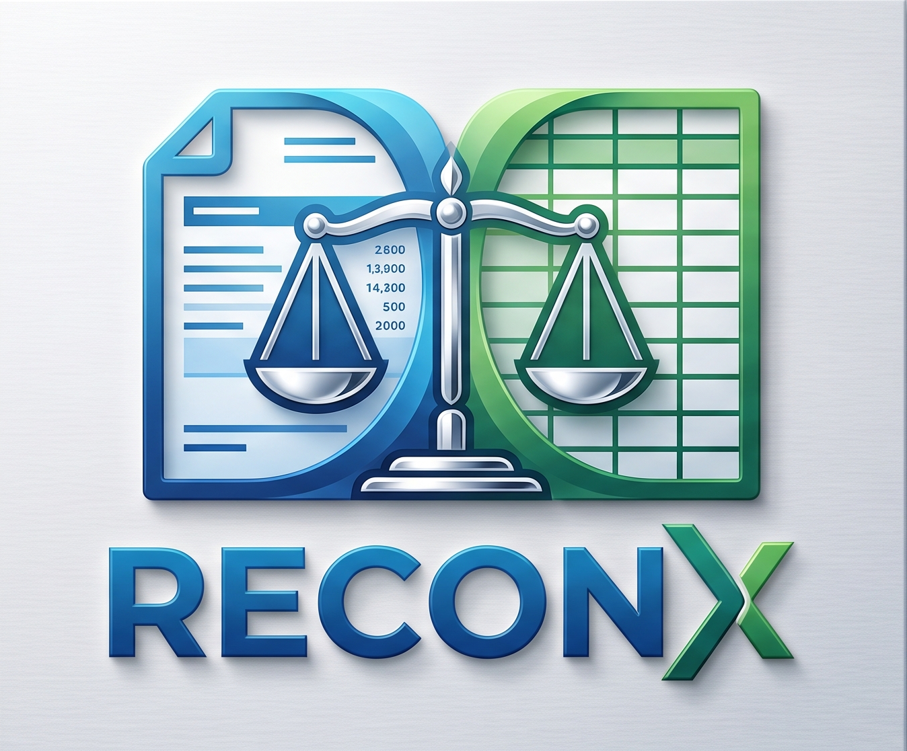

  

  # ReconX - Bank Statement Converter (PDF to Excel & CSV)

  **100% Offline, Bank-Grade Privacy Desktop Engine for Chartered Accountants, Tax Auditors, and Businesses.**

  
  
  
  

   

  [**🌐 Visit Official Website**](https://reconx-sigma.vercel.app/) • [**📥 Download ReconX Setup (.exe)**](https://github.com/kavathiya-ayush/CA-Converter-Releases/raw/main/ReconX_Setup.exe) • [**📖 Installation Guide**](https://reconx-sigma.vercel.app/) • [**📞 Support**](https://reconx-sigma.vercel.app/contact.html)

---

## 📌 Overview

**[ReconX](https://reconx-sigma.vercel.app/)** is a desktop application engineered specifically for Indian Chartered Accountants (CAs), tax auditors, accountants, and businesses. It effortlessly converts complex, password-protected, and multi-page PDF bank statements into clean, structured Excel (`.xlsx`) and `.csv` spreadsheets.

Unlike generic cloud-based converters that require uploading sensitive banking files to remote servers, **ReconX runs 100% locally on your machine**. Zero bank records, account numbers, or financial transactions ever leave your computer.

---

## ✨ Key Features

- 🔒 **100% Offline & Local Processing:** Total client privacy with zero cloud data uploads.
- 🔑 **Password Protected PDF Support:** Decrypts encrypted bank statements (PAN, Date of Birth, Custom) directly on your device.
- 🏛️ **30+ Supported Indian Banks:** State Bank of India (SBI), HDFC Bank, ICICI Bank, Axis Bank, Kotak Mahindra Bank, Punjab National Bank (PNB), Bank of Baroda, Canara Bank, and more.
- 📊 **Accounting & Tally Prime Ready:** Pre-formatted output with separate Date, Narration, Cheque/Ref No, Debit, Credit, and Balance columns.
- 🧮 **Mathematical Balance Reconciliation:** Verifies opening balance + total credits - total debits = closing balance automatically.
- ⚡ **Sub-Second Processing:** Converts 50+ page bank statements in seconds.

---

## 🏦 Supported Indian Banks

| Bank Name | Statement Format | Password Decryption | Tally / Excel Export |
|:---|:---:|:---:|:---:|
| **State Bank of India (SBI)** | YONO / Online Banking | ✅ Supported | ✅ Pre-formatted |
| **HDFC Bank** | NetBanking / Email PDF | ✅ Supported | ✅ Pre-formatted |
| **ICICI Bank** | iMobile / Corporate NetBanking | ✅ Supported | ✅ Pre-formatted |
| **Axis Bank** | Internet Banking | ✅ Supported | ✅ Pre-formatted |
| **Kotak Mahindra Bank** | Kotak NetBanking PDF | ✅ Supported | ✅ Pre-formatted |
| **Punjab National Bank (PNB)** | PNB ONE / Retail PDF | ✅ Supported | ✅ Pre-formatted |
| **Bank of Baroda (BOB)** | Baroda Connect | ✅ Supported | ✅ Pre-formatted |
| **Canara Bank** | Canara e-Banking | ✅ Supported | ✅ Pre-formatted |
| *And 25+ more Indian banks...* | *Standard & Custom Formats* | ✅ Supported | ✅ Pre-formatted |

---

## 🚀 Quick Download & Installation

1. **Download Setup:** [Download `ReconX_Setup.exe`](https://github.com/kavathiya-ayush/CA-Converter-Releases/raw/main/ReconX_Setup.exe).
2. **Double-click to install:** Run the installer on Windows 10 or Windows 11.
3. **If Windows SmartScreen appears:** Click **"More info"** and select **"Run anyway"**.
4. **Launch ReconX:** Drag and drop your bank statement PDF to convert to Excel instantly!

---

## 🌐 Official Links & Resources

- **Website:** [https://reconx-sigma.vercel.app/](https://reconx-sigma.vercel.app/)
- **Download Link:** [ReconX Windows Setup (.exe)](https://github.com/kavathiya-ayush/CA-Converter-Releases/raw/main/ReconX_Setup.exe)
- **Terms of Service:** [https://reconx-sigma.vercel.app/terms.html](https://reconx-sigma.vercel.app/terms.html)
- **Privacy Policy:** [https://reconx-sigma.vercel.app/privacy.html](https://reconx-sigma.vercel.app/privacy.html)
- **Cancellation & Refund Policy:** [https://reconx-sigma.vercel.app/refund.html](https://reconx-sigma.vercel.app/refund.html)
- **Contact Support:** [ayushkavathiya322@gmail.com](mailto:ayushkavathiya322@gmail.com)

---

## 📄 License & Copyright

Copyright © 2026 **ReconX Software Solutions**. All rights reserved.  
100% Offline Bank Statement Converter for Windows.
